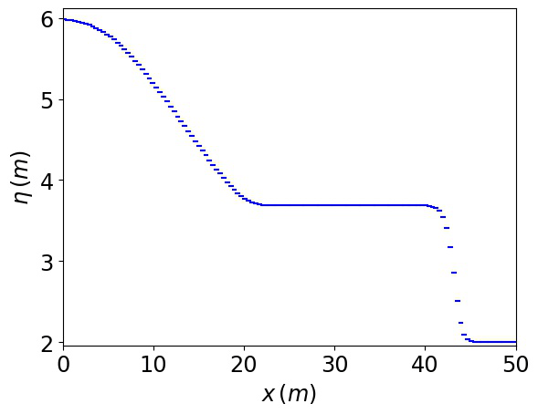
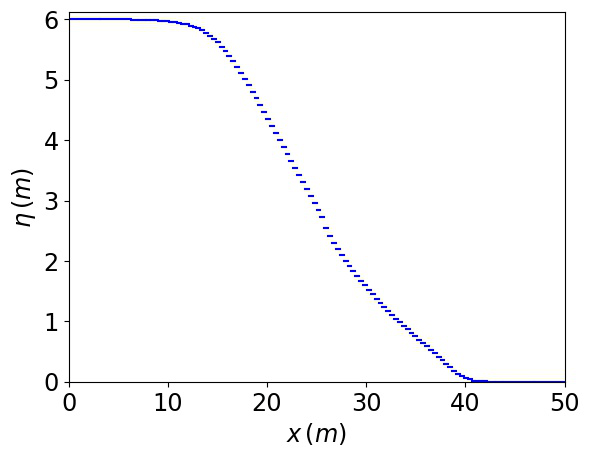
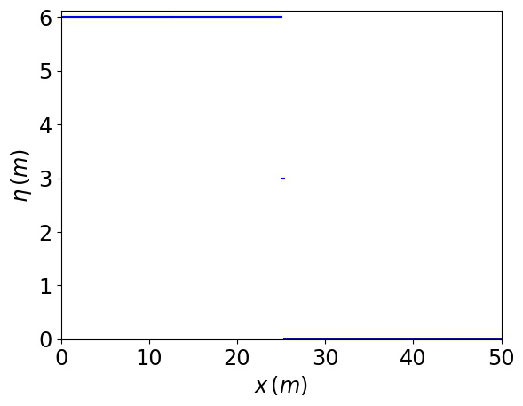
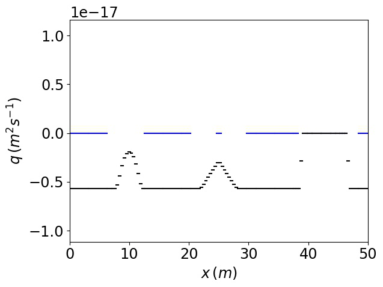
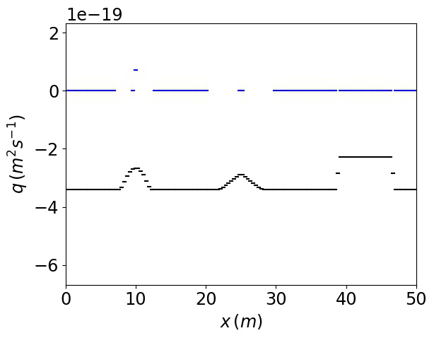
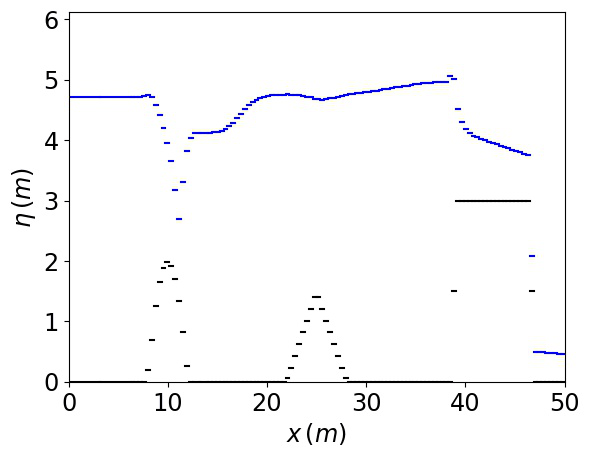
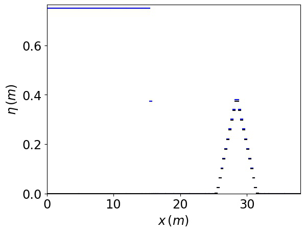

# .

## About

This project is a shallow water model that is based on [this paper](https://www.sciencedirect.com/science/article/pii/S0309170819301770).

To use this model you need to have [Visual Studio 2019](https://visualstudio.microsoft.com/downloads/) or higher. You also need to have [Python](https://www.python.org/downloads/).

## Building the model executable

Open the `..sln` file in Visual Studio 2019 and from the toolbar at the top, click `Build > Rebuild All`.

## Running the model

Navigate to `.\.` using File Explorer. Click into the search bar of the explorer, type in `cmd` and press enter to open a command line. In the command line, type in `python test.py` and press enter to see further instructions on how to run the model.

## In-built test cases

The model supports 7 in-built tests. The outputs from each test are shown in the animations below. The animations can be used to check for correctness if the model is modified in any way. 

### Wet dam break

### Dry dam break

### Dry dam break with friction

### Wet c-property

### Wet/dry c-property

### Building overtopping

### Triangular dam break

